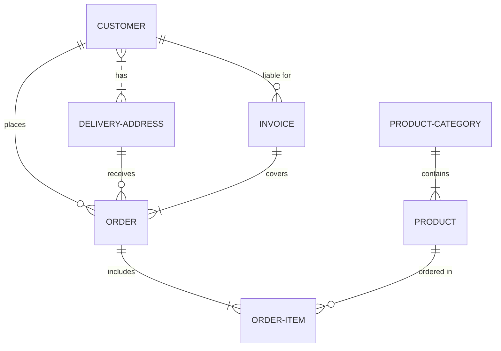

## What is the X Developer Platform?

The X Developer Platform gives developers, researchers, and businesses programmatic access to the data and functionality that powers X. Through a set of REST APIs, streaming endpoints, and official SDKs, you can read and write tweets, manage users and lists, participate in Spaces, send direct messages, and tap into the real-time pulse of public conversation — all at the scale your project demands.

The platform is designed for builders of every kind: indie developers shipping side projects, enterprise teams integrating X data into their products, and academic researchers studying online discourse. A tiered access model means you pay for only what you need, from a free sandbox tier to a fully customized enterprise plan.

---

## X API v2 overview

The current version of the X API — **v2** — is the primary interface for all new development. It offers a consistent, field-expansion-based query model, richer data objects than previous versions, and actively receives new features.

The API is organized into the following major endpoint categories:

| Category | What it covers |
| --- | --- |
| **Tweets** | Create, delete, like, retweet, quote, look up, and search tweets. Includes full-archive search on eligible tiers. |
| **Users** | Look up users by ID or username, manage followers and following, mute and block. |
| **Spaces** | Discover live and scheduled Spaces, retrieve Spaces by creator or ID, look up participants. |
| **Lists** | Create and manage Lists, add or remove members, get tweets from a List timeline. |
| **Direct Messages** | Send and retrieve DMs, manage conversation participants, look up DM events. |
| **Streams** | Connect to a real-time filtered stream (rule-based) or a 1% sampled stream of all public tweets. |

Every response uses a shared data model. You request exactly the fields you need — such as `tweet.fields`, `user.fields`, and `expansions` — so you don't over-fetch data.

---

## Access tiers

The X Developer Platform offers four access tiers. Each tier unlocks a different level of API throughput and endpoint availability.

| Feature | Free | Basic | Pro | Enterprise |
| --- | --- | --- | --- | --- |
| **Monthly tweet reads** | 500,000 | 1,000,000 | 10,000,000 | Custom |
| **Monthly tweet writes** | 1,500 | 3,000 | 300,000 | Custom |
| **Full-archive search** | ❌ | ❌ | ✅ | ✅ |
| **Filtered stream** | ❌ | ❌ | ✅ | ✅ |
| **Price** | \$0 | \$100 / mo | \$5,000 / mo | Contact sales |
| **Best for** | Prototyping, learning | Small apps | Production apps | Large-scale platforms |

You can upgrade or downgrade your tier at any time from the [Developer Portal](https://developer.x.com/portal). See [Access Levels](/getting-started/access-levels) for a full comparison.

---

## What you can build

The X API v2 is flexible enough to power a wide variety of products and workflows:

- **Social applications** — Build X-integrated apps that let users log in with X, post content, or display their timeline in a custom interface.
- **Analytics dashboards** — Aggregate engagement metrics, track trending topics, and visualize conversation patterns over time.
- **Automation tools** — Schedule posts, auto-reply to mentions, or sync X activity with other platforms and internal systems.
- **Research tools** — Collect datasets of public tweets for sentiment analysis, network mapping, or social science studies.
- **Content moderation** — Detect and flag harmful content, monitor brand mentions, and surface high-priority signals at scale.
- **Bots and agents** — Create automated accounts that deliver useful information, run games, or respond to user queries in real time.

---

## Next steps

<CardGroup cols={2}>
  <Card title="Quickstart" icon="a" href="/quickstart">
    Make your first API call in under five minutes with a step-by-step walkthrough.
  </Card>

  <Card title="Authentication" icon="key" href="/authentication/overview">
    Learn which OAuth flow — 2.0 or 1.0a — is right for your app, and how to implement it correctly.
  </Card>
</CardGroup>